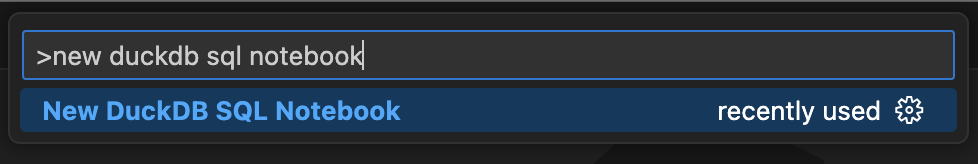
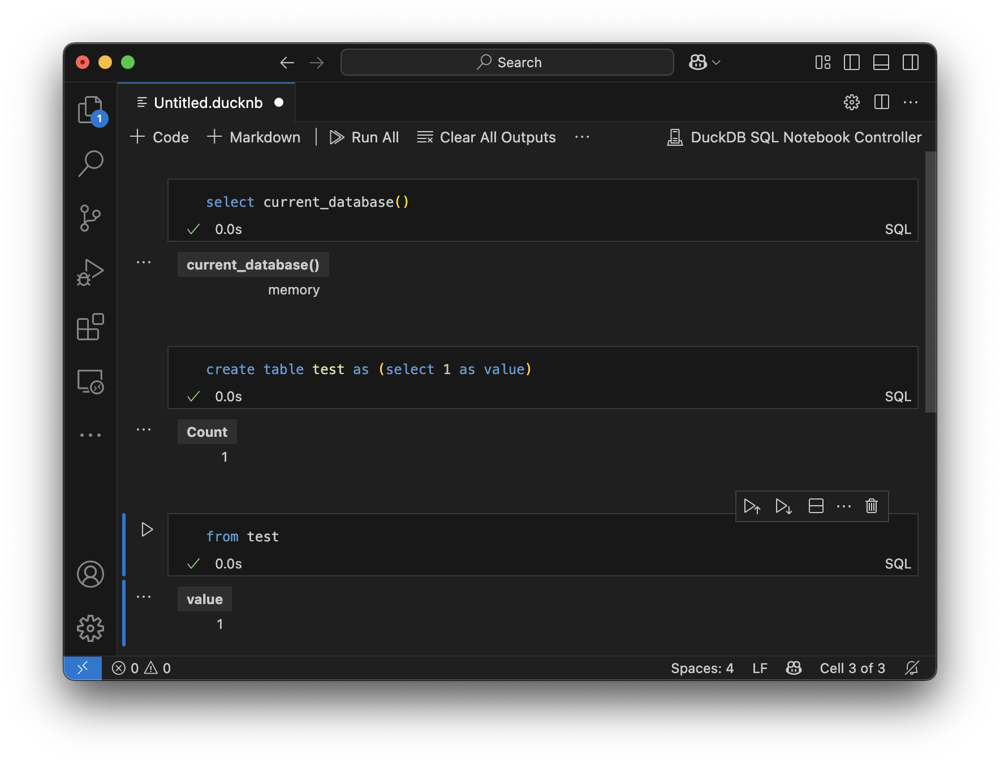

#  ducknb

VSCode Extension for Apple Silicon Macs that enables DuckDB SQL Notebooks

# Installation

[VSCode Marketplace](https://marketplace.visualstudio.com/items?itemName=sahilng.ducknb)

#  Usage

Create/open a `.ducknb` file or use the `ducknb: New DuckDB SQL Notebook` command.

# Example

